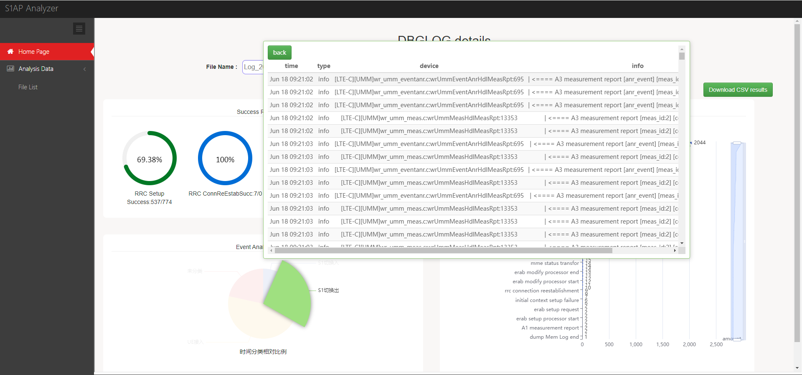
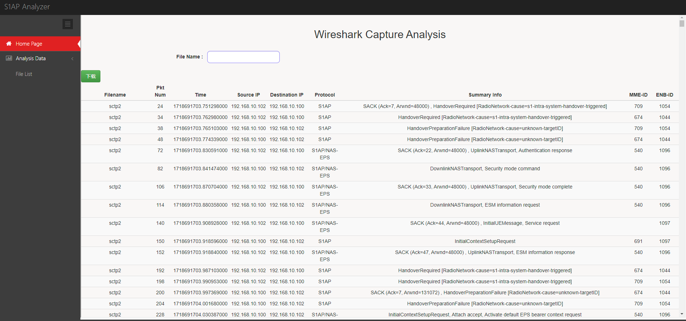

# Demo Site

You can access the demo site here:[Demo Website](http://117.72.83.134:9090/)

This is a demo site, and some features may not work fully outside the company network. The server is in China, so file uploads may be slow.

# Screenshots

YX.png)





# Prerequisites

Wireshark and tshark

MySQL=5.7

Golang>=1.22.5

Python=3.11

# How to Run

    cd ~
    git clone https://github.com/king0ffire/Base-Station-Log-Analysis-System
    git clone https://github.com/KimiNewt/pyshark.git
    cd pyshark/src
    python setup.py install

    cd ~/Base-Station-Log-Analysis-System
    pip install -r ./scripts/requirements.txt

Disable `secure-file-priv` in MySQL, by modifing `my.cnf` or `my.ini` of MySQL

    [mysqld]
    secure-file-priv = path/to/BASE-STATION-LOG-ANALYSIS-SYSTEM/cache

    or

    [mysqld]
    secure-file-priv = ""


and then create a database in MySQL.

There are 2 ways to run this system.

1. Adapt `config.ini`. Then, run `python ./scripts/server.py` and `go run web.go` in sperate shell.

2. (Make it a Service) Adapt `config.ini`, `loganalyzepythonserver.service` and `loganalyzewebapp.service` to your server, then:
```
sudo cp ./loganalyzepythonserver.service /etc/systemd/system/
sudo cp ./loganalyzewebapp.service /etc/systemd/system/
sudo systemctl daemon-reload
sudo systemctl start loganalyzewebapp.service
```
# Example

There is an example of a base station log file located in the example folder. You can upload it to check how it works.